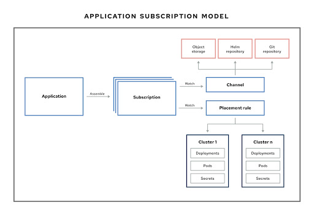

# Overview

The application management is a component of the [open-cluster-management.io](https://open-cluster-management.io/) project. There are a few concepts to understand:

1. Channel: Resource representing a source repository. Github repository, Helm chart repository, Objectstore with YAML or namespace containing Kubernetes resource templates (deployables)

2. Subscription: Subscribes a repository and delivers kubernetes resources.

3. Placement Rule: Referenced by subscriptions, and supplies the target managed clusters that must subscribe to a channel.

4: Application: Used to select all of the subscriptions that are part of your application (a visual aid)



# Getting started

To run application management, follow [the documentation](https://open-cluster-management.io/getting-started/integration/app-lifecycle/) to install the prerequisites and then deploy the subscription operators and add-on.

Once all these are set, let's start with deploying a single application helloworld.

1. Save the following yaml content to your local file with anyname, but I will use helloworld.yaml for following reference.

```yaml
apiVersion: v1
kind: Namespace
metadata:
  name: helloworld-app-ns
---
apiVersion: app.k8s.io/v1beta1
kind: Application
metadata:
  name: helloworld-app
  namespace: helloworld-app-ns
spec:
  componentKinds:
    - group: apps.open-cluster-management.io
      kind: Subscription
  descriptor: {}
  selector:
    matchExpressions:
      - key: app
        operator: In
        values:
          - helloworld-app
---
apiVersion: apps.open-cluster-management.io/v1
kind: Subscription
metadata:
  annotations:
    apps.open-cluster-management.io/git-branch: main
    apps.open-cluster-management.io/git-path: helloworld
    apps.open-cluster-management.io/reconcile-option: merge
  labels:
    app: helloworld-app
  name: helloworld-app-subscription-1
  namespace: helloworld-app-ns
spec:
  channel: ggithubcom-fxiang1-app-samples-ns/ggithubcom-fxiang1-app-samples
  placement:
    placementRef:
      kind: PlacementRule
      name: helloworld-app-placement-1
---
apiVersion: apps.open-cluster-management.io/v1
kind: PlacementRule
metadata:
  labels:
    app: helloworld-app
  name: helloworld-app-placement-1
  namespace: helloworld-app-ns
spec:
  clusterSelector:
    matchLabels:
      "local-cluster": "true"
```

2. Confirm you are logged in to the hub cluster. To verify, you could run the following command and ensure to have similar output.

```bash
oc get route multicloud-console -n ${NAMESPACE_WHERE_INSTALL_OCM}
NAME                 HOST/PORT                                                                 PATH   SERVICES             PORT    TERMINATION          WILDCARD
multicloud-console   multicloud-console.${WEB_ENDPOINT}          management-ingress   https   reencrypt/Redirect   None
```

3. Once the validation pass, execute the command to apply the helloworld.yaml resource. Sample output is:

```bash
oc apply -f helloworld.yaml
namespace/helloworld-app-ns created
application.app.k8s.io/helloworld-app created
subscription.apps.open-cluster-management.io/helloworld-app-subscription-1 created
placementrule.apps.open-cluster-management.io/helloworld-app-placement-1 created
```

4. Wait for 1-2 minutes, hover over to the multicloud-console route and navigate to /applications. Find the newly created application with name ` helloworld-app`. Click the name.

The Topology page will show the information based on the selected app and related apps. Clicking the nodes will show details about the selected type of resources.

# References

1. [open-cluster-management.io](https://open-cluster-management.io) - the official project website.
2. [Application samples](https://github.com/fxiang1/app-samples) - some sample application resources.
